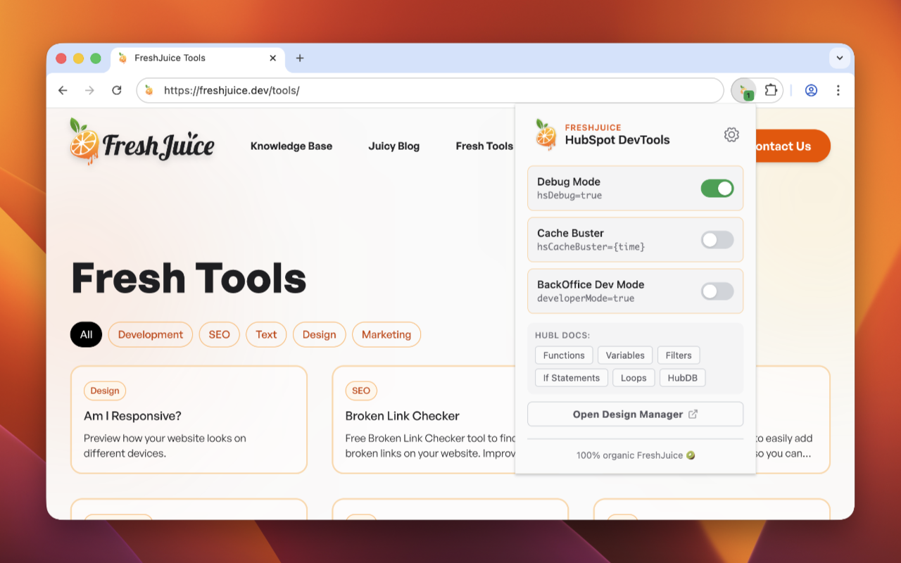
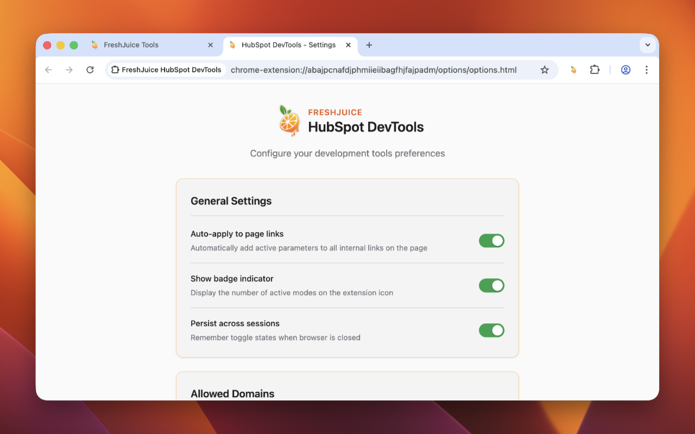
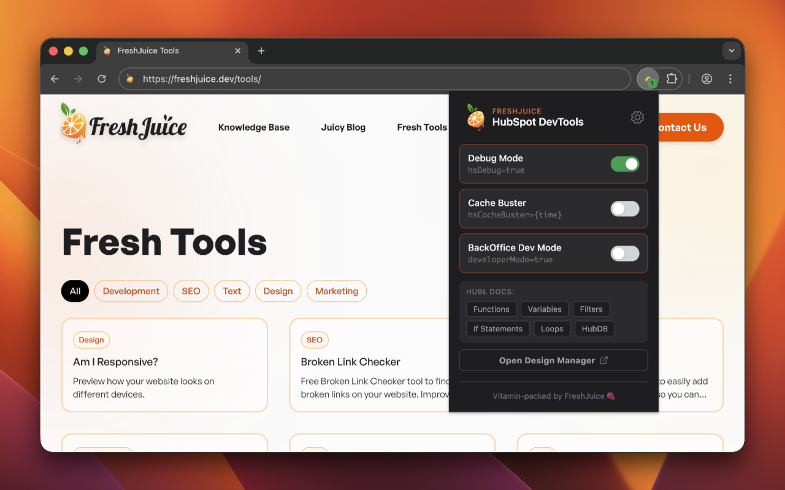
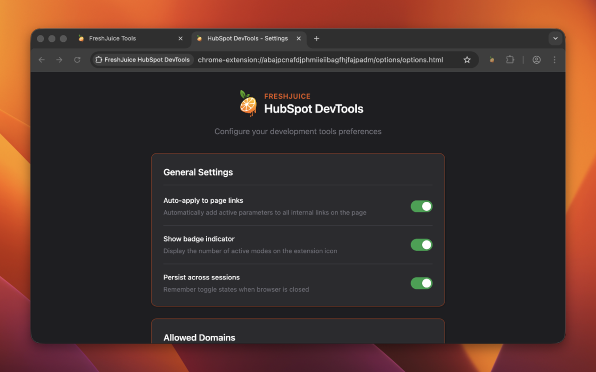
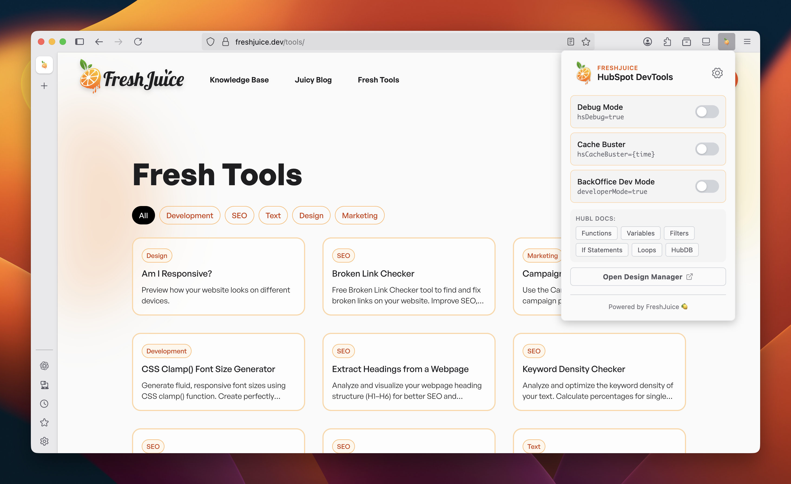
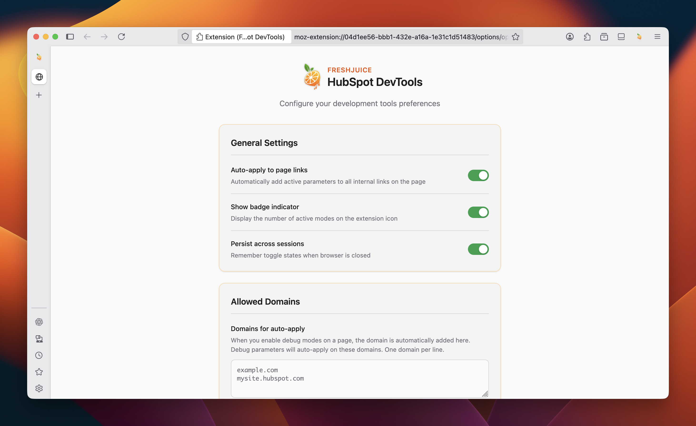
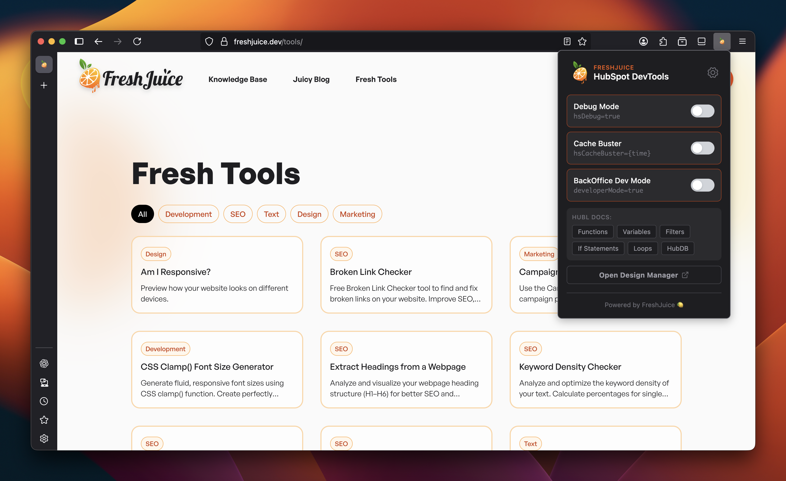
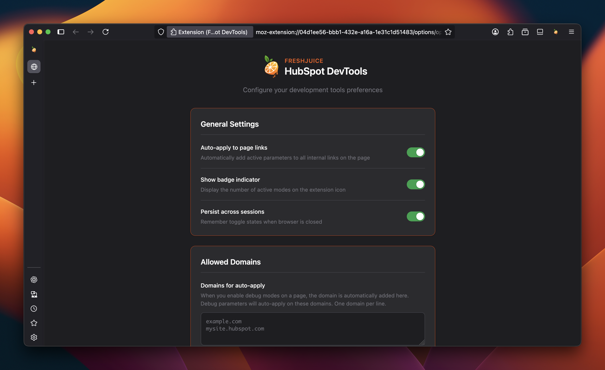

# FreshJuice HubSpot DevTools

[](https://github.com/freshjuice-dev/hubspot-devtools-extension/releases)
[](LICENSE)
[](https://chromewebstore.google.com/detail/jmlcckldioeofjchfaomgaimhpnlfgok)
[](https://addons.mozilla.org/en-US/firefox/addon/freshjuice-hubspot-devtools/)
[](https://github.com/freshjuice-dev/hubspot-devtools-extension/stargazers)
[](https://github.com/freshjuice-dev/hubspot-devtools-extension/network/members)
[](https://github.com/freshjuice-dev/hubspot-devtools-extension/watchers)

A browser extension for HubSpot CMS developers with quick access to debug parameters and HubL documentation.

**[Learn more at freshjuice.dev/hubspot-devtools](https://freshjuice.dev/hubspot-devtools/)**

## Features

- **Debug Mode Toggle** - Quickly add `hsDebug=true` to your current page
- **Cache Buster** - Add `hsCacheBuster={timestamp}` to bypass caching
- **BackOffice Dev Mode** - Enable `developerMode=true` for HubSpot backend
- **Auto-apply to Links** - Automatically propagate debug parameters to internal links
- **HubL Quick Links** - Fast access to HubL documentation (Functions, Variables, Filters, Loops, If Statements, HubDB)
- **Design Manager** - One-click access to HubSpot Design Manager

## Screenshots

### Chrome

<p align="center">
  
  
</p>
<p align="center">
  
  
</p>

### Firefox

<p align="center">
  
  
</p>
<p align="center">
  
  
</p>

## Installation

### Install from Store (Recommended)

[](https://chromewebstore.google.com/detail/jmlcckldioeofjchfaomgaimhpnlfgok)
[](https://addons.mozilla.org/en-US/firefox/addon/freshjuice-hubspot-devtools/)

<details>
<summary><strong>Manual Installation</strong></summary>

#### Chrome

1. Download the latest release from [Releases](https://github.com/freshjuice-dev/hubspot-devtools-extension/releases)
2. Unzip `hubspot-devtools-chrome-*.zip`
3. Open `chrome://extensions/`
4. Enable "Developer mode"
5. Click "Load unpacked" and select the unzipped folder

#### Firefox

1. Download the latest release from [Releases](https://github.com/freshjuice-dev/hubspot-devtools-extension/releases)
2. Open `about:addons`
3. Click the gear icon and select "Install Add-on From File..."
4. Select `hubspot-devtools-firefox-*.zip`

</details>

## Development

### Prerequisites

- Node.js 22+

### Setup

```bash
# Install dependencies
npm install

# Build for all browsers
npm run build:all

# Build for specific browser
npm run build:chrome
npm run build:firefox

# Watch mode for development
npm run dev:chrome
npm run dev:firefox

# Create release zips
npm run release
```

### Testing & Validation

```bash
# Run unit tests
npm run test

# Run ESLint
npm run lint

# Validate Chrome extension
npm run validate:chrome

# Validate Firefox extension
npm run validate:firefox

# Run all validations (lint + test + chrome + firefox)
npm run validate
```

### Project Structure

```
src/
├── manifest/        # Browser-specific manifest files
├── popup/           # Extension popup UI
├── options/         # Settings page
├── background/      # Service worker / background script
├── content/         # Content script for link modification
├── lib/             # Shared utilities
└── assets/          # Icons and images
```

## Contributing

We welcome contributions from the community! Here's how you can help:

### Reporting Bugs

Found a bug? Please [open an issue](https://github.com/freshjuice-dev/hubspot-devtools-extension/issues/new?template=bug_report.md) with:
- Browser and version
- Extension version
- Operating system
- Steps to reproduce
- Expected vs actual behavior

### Suggesting Features

Have an idea? [Submit a feature request](https://github.com/freshjuice-dev/hubspot-devtools-extension/issues/new?template=feature_request.md) describing:
- The problem you're trying to solve
- Your proposed solution
- Any alternatives you've considered

### Pull Requests

Want to contribute code? Great!

1. Fork the repository
2. Create a feature branch (`git checkout -b feature/amazing-feature`)
3. Make your changes
4. Test on both Chrome and Firefox
5. Commit your changes (`git commit -m 'Add amazing feature'`)
6. Push to the branch (`git push origin feature/amazing-feature`)
7. Open a Pull Request

## Privacy

This extension does not collect any personal data. See our [Privacy Policy](PRIVACY.md) for details.

## Changelog

See [CHANGELOG.md](CHANGELOG.md) for a list of changes.

## License

[MIT](LICENSE) - Created by [Alex Zappa](https://alex.zappa.dev) at [FreshJuice](https://freshjuice.dev)
